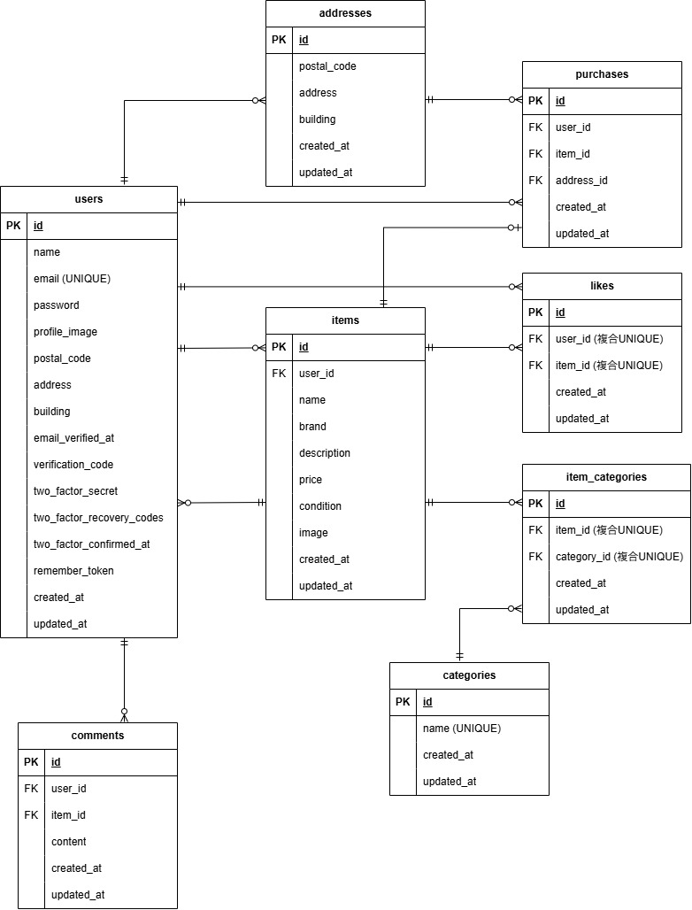

# COACHTECH 模擬案件：フリマアプリ

## 環境構築

### リポジトリのクローン
```bash
git clone https://github.com/mina-lu7/coachtech-flea-market.git
cd coachtech-flea-market
```

### Dockerビルド・起動
```bash
docker compose up -d --build
```

### Laravel環境構築
```bash
docker compose exec app composer install
cp src/.env.example src/.env
```

※ 必要に応じて src/.env ファイルの環境変数を変更してください。
※ 初回起動時は、src/.env のDB接続設定を docker-compose.yml の設定値と合わせてください。

```bash
docker compose exec app bash -c "cd src && php artisan key:generate"
docker compose exec app bash -c "cd src && php artisan storage:link"
docker compose exec app bash -c "cd src && php artisan migrate:fresh --seed"
```

## DB接続設定（docker-compose.ymlの設定値）
以下の内容を src/.env に設定してください。
```env
DB_CONNECTION=mysql
DB_HOST=db
DB_PORT=3306
DB_DATABASE=flea_db
DB_USERNAME=flea_user
DB_PASSWORD=flea_pass
```

## 環境変数
.env.example を参考に .env を作成してください。
Stripe決済機能を使用する場合は、以下を設定してください。
```env
STRIPE_KEY=
STRIPE_SECRET=
```

## 使用技術（実行環境）
- PHP 8.2
- Laravel 12.55.1
- Laravel Fortify
- MySQL 8.0
- nginx 1.25-alpine
- Docker / Docker Compose
- MailHog
- Stripe


## ER図



## URL（開発環境）
- 商品一覧：http://localhost:8080
- 会員登録：http://localhost:8080/register
- ログイン：http://localhost:8080/login
- phpMyAdmin：http://localhost:8081
- MailHog：http://localhost:8025

## ログイン情報

### 出品者ユーザー
- メールアドレス：seller@example.com
- パスワード：password
### 購入者ユーザー
- メールアドレス：buyer@example.com
- パスワード：password

## テスト実行
```bash
docker compose exec app bash -c "cd src && php artisan test"
```
※要件に記載されたテストケースに加えて、品質確認のため一部追加テストを実装しています。
　追加したテストは、既存要件の動作確認を目的としたものです。