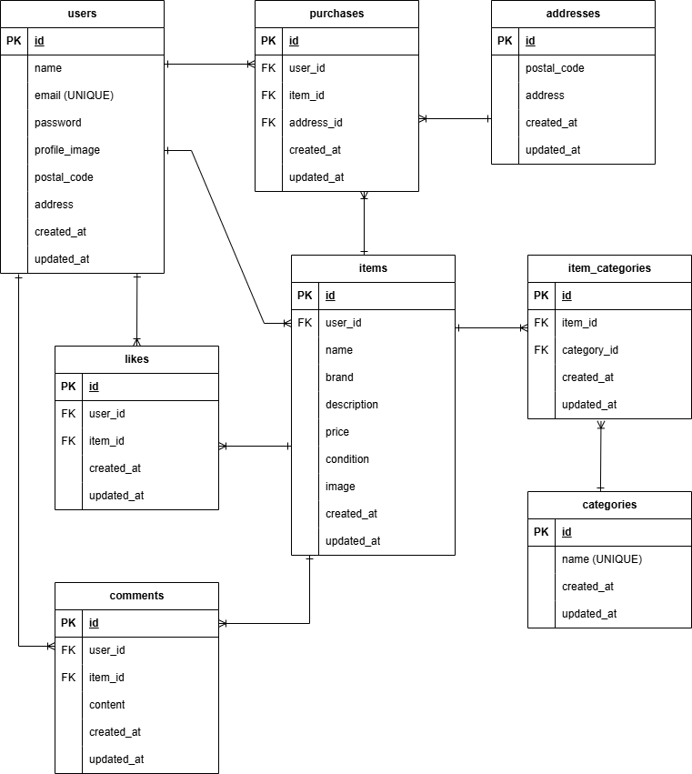

# COACHTECH 模擬案件：フリマアプリ

## 環境構築

### リポジトリのクローン
```bash
git clone https://github.com/mina-lu7/coachtech-flea-market.git
cd coachtech-flea-market
```

### Dockerビルド・起動
```bash
docker compose up -d --build
```

### Laravel環境構築
```bash
docker compose exec app composer install
cp src/.env.example src/.env
docker compose exec app bash -c "cd src && php artisan key:generate"
```
※ 必要に応じて src/.env ファイルの環境変数を変更してください。
※ 初回起動時は、src/.env のDB接続設定を docker-compose.yml の設定値と合わせてください。
```bash
docker compose exec app bash -c "cd src && php artisan migrate"
```

## DB接続設定（docker-compose.ymlの設定値）
以下の内容を src/.env に設定してください。
```env
DB_CONNECTION=mysql
DB_HOST=db
DB_PORT=3306
DB_DATABASE=flea_db
DB_USERNAME=flea_user
DB_PASSWORD=flea_pass
```

## 使用技術（実行環境）
- PHP：8.2
- Laravel：12.55.1
- MySQL：8.0
- Docker / Docker Compose
- nginx
- Laravel Fortify

## ER図



## URL（開発環境）
- 商品一覧：http://localhost:8080
- 会員登録：http://localhost:8080/register
- ログイン：http://localhost:8080/login

## ログイン情報
### テストユーザー
- メールアドレス：test@example.com
- パスワード：password
※必要に応じてSeeder等で作成してください。